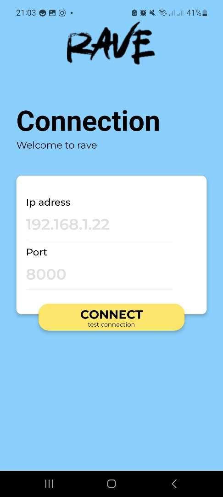
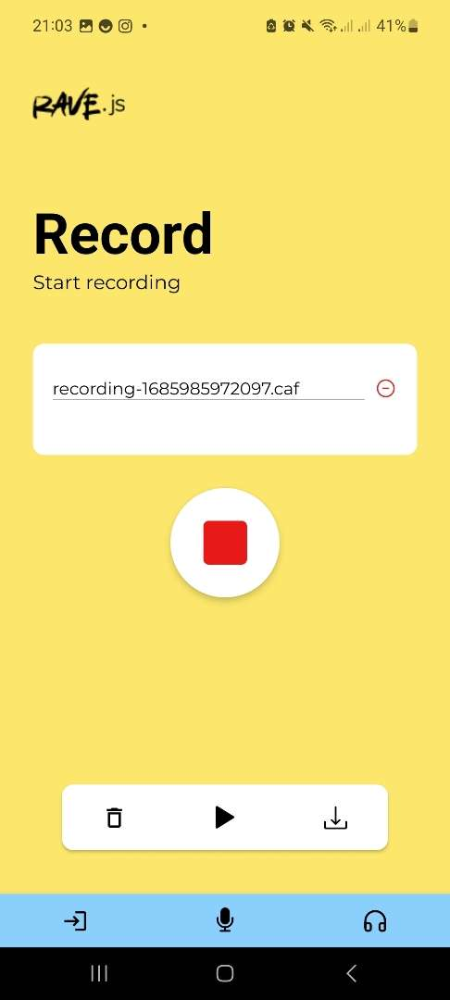
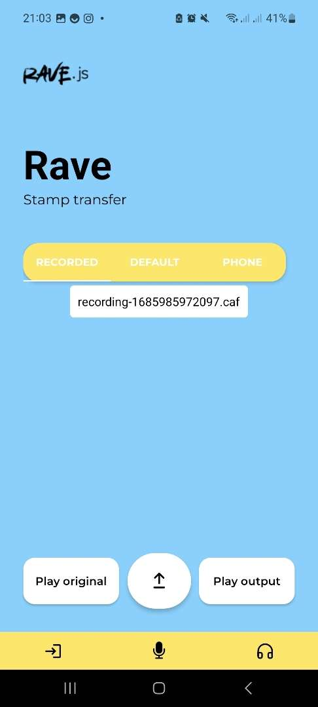

# Project Rave🎙️
I've put a lot of effort into this project so that it has a remarkable code structure and an architecture worthy of the name.

The aim of this project is to develop a stamp transfer application in React-Native using [expo](https://docs.expo.dev/) and [jsdoc](https://jsdoc.app/index.html) for commenting structure. 
Stamp transfer will be performed by a neural network, the RAVE model developed by Antoine Caillon at ircam. 

You can find a demonstration very similar to this application at https://caillonantoine.github.io/ravejs/.

## 🎉 Getting started 

#### VIEWS




### The prerequisites

You must have node with npm installed.

### 👼 Creating the project 

1. Copy the project with git clone:

```sh
# clone most recent project
git clone https://github.com/YoubaImkf/rave.git
# enter project folder
cd project ./rave
```


### ⚙️ Setup environment 


1. Install the node packages:

```sh
npm install
```

### ▶️ Running the app 


Start the web app with:

```sh
npx expo start  # live reloading mode
```
___

